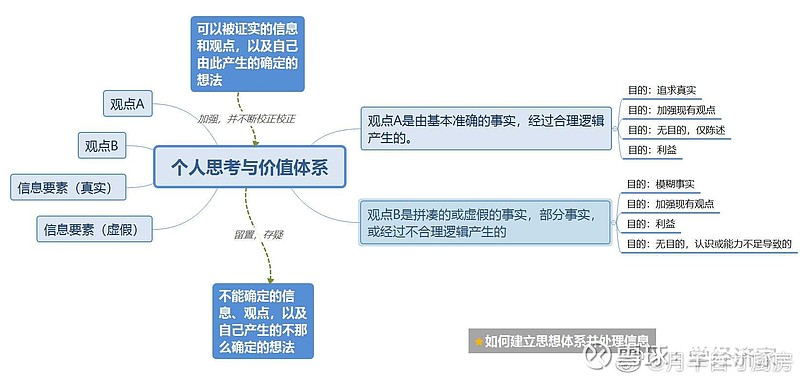

我们的头脑每天接触很多输入，如图在左边。这些输入可以被分为两类：
1.信息
2.观点

所谓信息，happenings，occasions，比如有个煤矿，两个人甲和乙，都不知道不很了解煤炭，包括煤炭的颜色，煤炭的用途和性质，煤炭对他们是一个比较陌生的事务，但又不是完全陌生的。甲下去看了看，上来告诉乙煤炭是黑色的，就是一个事实，是真实的信息。如果甲回来后，告诉乙，煤炭是橙色的，也是一个信息，是虚假的信息，或者被加工过的信息。甲为什么要提供虚假信息呢，图中写了几个原因。

观点是事实基础上的个人看法，比如，甲对乙说，现在找到煤矿了，我认为我们可以进行占卜了。这是一种观点。乙这时说，我听说煤可以烧，晚上可以试试。这就是两种观点，一种是错误的观点，不贴切的观点，另一种是正确的观点。

每天看到的东西，除了这些没有其他的。正确的信息和观点，以及错误的信息和观点都可能有一定的目的性（如果我这时候写，都一定有目的性，这也是一种观点，而这种观点是错误的，为什么，图中有。）。

一个人，看到了信息和观点，无论他是否意识到了，自己内心都会有一些既定的想法和思想体系，这些个人的想法和价值体系，会对他看到的信息和观点进行比对和处理。符合他想法的，就变成了加强他思考结论的东西。不符合的，就被抛弃了，或者他会给出自己的相反的观点。这样，这个人就变成了一个特定容器，其实他并没有思考。因为他就像一个只接收某一类（符合他心意和认知的）信息和观点。一个人变成这样，那么他的思想体系就完全没有建立起来。

因为他没有去验证。这时一个重要分歧产生了，就是这个人自己的想法和价值体系是否是永远正确的，无所不知的，如果是，那么他只会接受正确的信息和观点。并加强。但他依然没有思辨能力。我的观点是，没有任何一个人是永远正确的，无所不知的，因此，一个人就需要对他接受到的信息和观点进行处置，能被证实的，放到上面，去加强自己的思想体系，有时候是否定，比如，一个人认为煤炭是不能燃烧的，然后晚饭是用的煤炭，那么他就发现，自己的想法和事实是相反的，这时，他处置自己的思想的方向，不是去加强煤炭无法燃烧的错误观点，而是纠正了这一点，他开始认识的煤炭是可以燃烧的，那么他的认知就向前，向着真理移了一步。思想体系的建立过程，开始了。

如果他接受了一个信息或观点，他无法证实，无法证伪，那么他会把这个东西放在下面的篮子里，存疑。

随着科学和能力的进步，他可能还会否定自己否定过的东西，比如，有人对他说，煤炭可以被用来制作钻石，在以前，这是错误的。但随着其他人发现，钻石的成分和煤炭接近的，都是碳元素组成的，如果可以提纯碳元素，然后施加很大压力，就可以生成人工钻石。这时，他否定了自己的观点，尽管那个观点在以前是正确的。

很多人对自己听到和看到的东西，具有目的性的内容，引导他们思想的内容是没有思考能力的。

比如一个袋子里面有个70个红色的球，30个绿色的。我每次都拿出绿色的球，给他看了10次，他由于没有思考能力，对我的目的也不了解，因此就认为袋子里全是绿色的，这就是普通人一辈子也难以逾越的第一关。后面还有几关。越往后的人越少。而这个结构必然是某种一半正态分布的，但正态分布的峰度等形态，可以通过选择信息和观点来进行“浇灌”，使得更多人保留在某种思维层次和模式中
